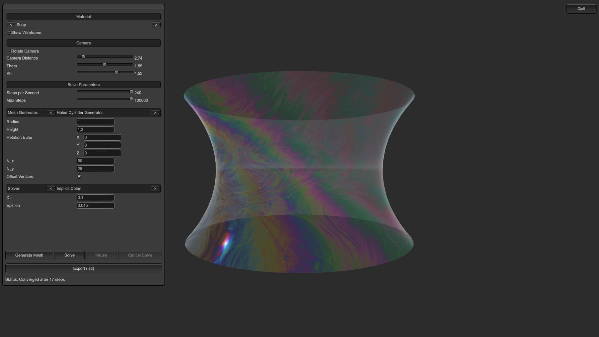

# MinimalSurfaces

MinimalSurfaces is a Unity-based program for the numerical computation and visualization of minimal surfaces on triangle meshes. It provides several mesh generators and solvers to compare different numerical approaches for surface minimization in an interactive way.

## Screenshot

## Download

Prebuilt binaries can be found under [Releases](https://github.com/sduemmen/MinimalSurfaces/releases).

## Features

- Interactive generation of triangle meshes
- Multiple numerical solvers for minimal surface computation
- Visualization of the resulting surfaces
- Import of external `.stl` meshes
- Export of generated meshes as `.stl`

## Source Code

The script files can be found under:

`Assets/Scripts`

## Known Issues

- Some `.stl` meshes fail to import correctly or are loaded with corrupted geometry, so imported models should be checked before running a simulation.
- When switching the material, the mean-curvature visualization is reset because `maxAbsH` is recomputed, which can cause regions with near-zero mean curvature to still appear strongly blue or red.
